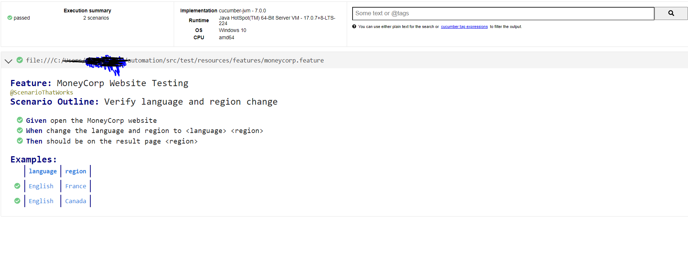

    project
    └── src
    └── test
    ├── java
    │   └── com
    │       └── example
    │           ├── pages
    │           │   └── HomePage.java
    │           ├── runner
    │           │   └── TestRunner.java
    │           └── steps
    │               └── StepDefinitions.java
    └── resources
    ├── application.properties
    └── features
    └── moneycorp.feature

To run 

    ./gradlew clean runCucumberTests

    Here we are using maven central and artifactory to build the project .

Attached below the cucumber report generated .the same can be made emailable if required 

Below steps are inadequate :

    WHY:as the UI perhaps changed and there is no such field available .
    Perhaps that requires a revisit .please let me know if any further details required .I would be happy to clarify .
    we can connect over call to discuss further .

    Click Find out more for “Foreign exchange solutions” Validate if you have arrived on the page
    
    Search for the word “international payments” using the search box
    
    Validate if you have arrived on the result page
    
    Validate that each article in the list displays a link that starts with https://www.moneycorp.com/en-us/  