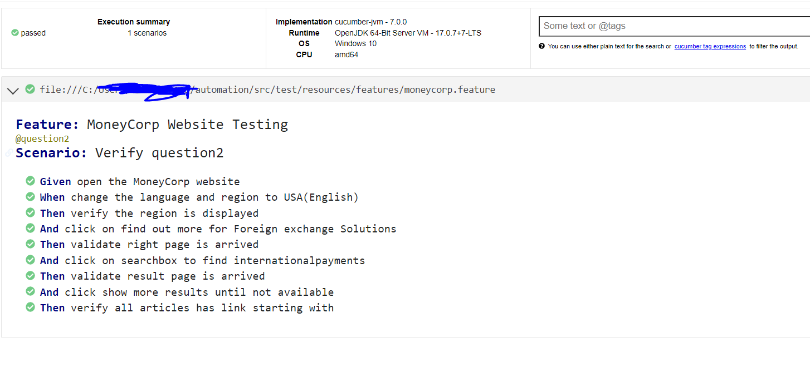

    project
    └── src
    └── test
        ├── java
        │   └── com
        │       └── example
        │           ├── pages
        │           │   └── HomePage.java
        │           ├── runner
        │           │   └── TestRunner.java
        │           └── steps
        │               └── StepDefinitions.java
        └── resources
        ├── application.properties
        └── features
        └── moneycorp.feature

To run 

    ./gradlew clean runCucumberTests

    Here we are using maven central and artifactory to build the project .

Attached below the cucumber report generated .the same can be made emailable if required 

